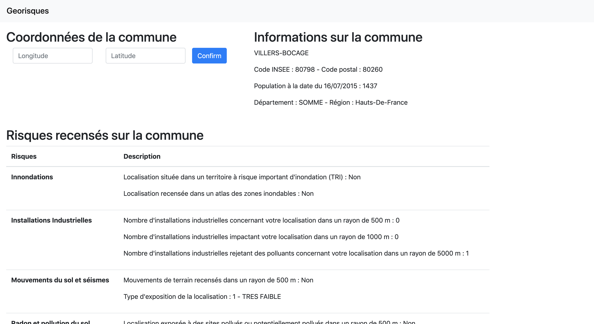

# Georisques

## Installation

``` text
source venv/bin/activate;
pip install -r requirements.txt
```

You will also need `redis` and `chromedriver`.

If you're on macos, run the following:

``` text
brew cask install chromedriver;
brew install redis;
brew services start redis;
```

## Run the app

``` text
export FLASK_APP=src/application;
flask run
```

Then open `localhost:5000` in your favorite browswer.
The app should launch, asking you for latitude and longitude values. Once provided, you shall see something like this:

